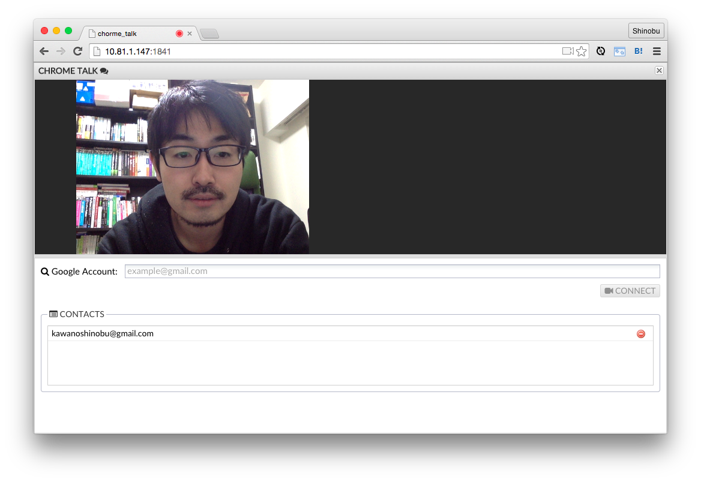
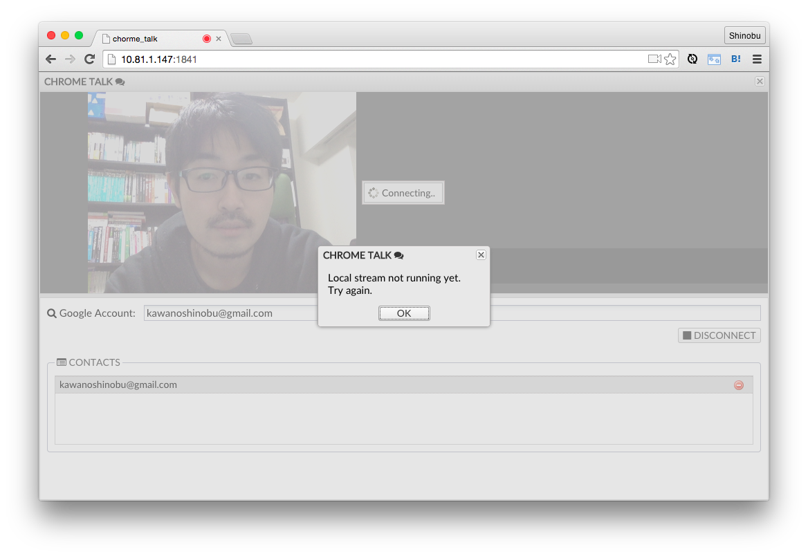
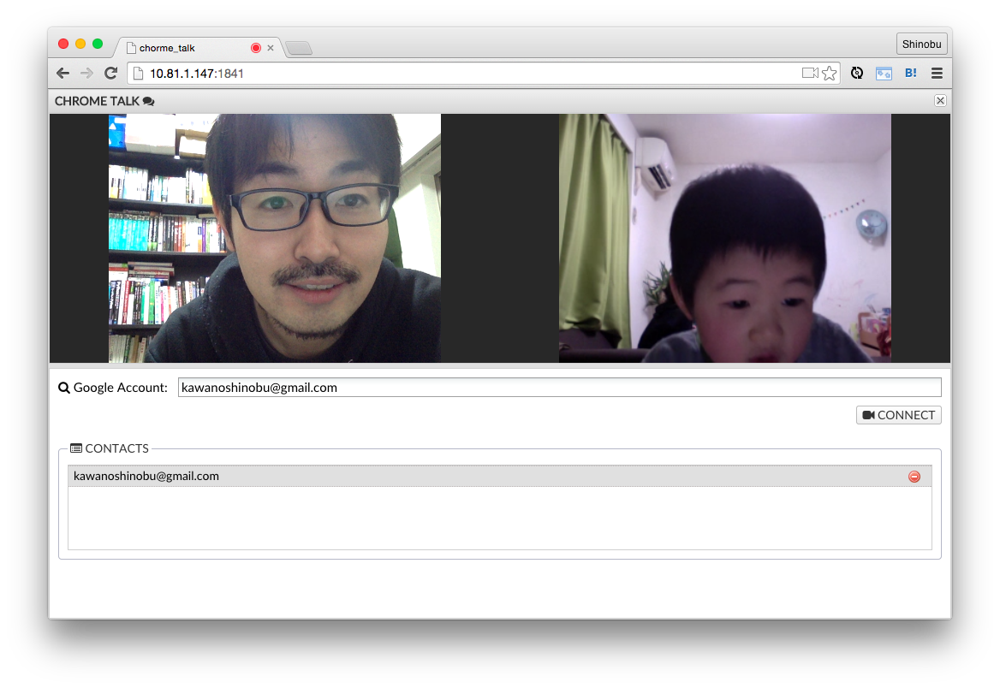

# CHROME TALK

Simple video chat application for Google Chrome. Powered by WebRTC and Sencha Ext JS.

This application is mainly purposes for learning WebRTC.

Feature
=======

1. Get user media.

2. Connect to another user (signaling by WebSocket).

3. Let's talk!

Installation
=======

* Client Side

Open chrome_talk.xds file with Sencha Architect, then save the project. The Sencha SDK is automatically prepared.

* ServerSide

Move to `server` directory, then execute the following command.

        $ npm install

To start the server program, simply open signaling.js file with Node.js.

        $ node signaling.js

Author
=======
* [KAWANO Shinobu](https://github.com/kawanoshinobu) - [http://kawanoshinobu.com](http://kawanoshinobu.com)

License
=======
Licensed under the GPL v3 License.

